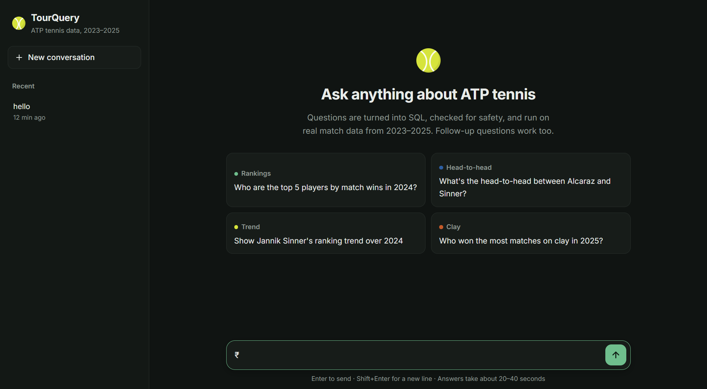
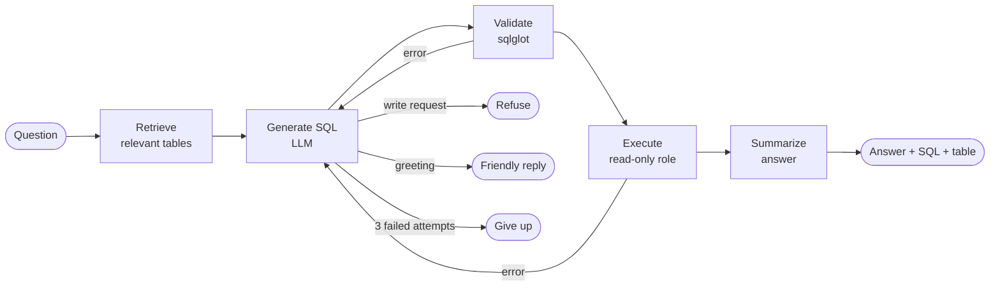

# TourQuery 🎾

**Ask questions about real ATP tennis data in plain English.** TourQuery turns each
question into SQL, checks it for safety, runs it against Postgres, and answers in plain
English — always showing the SQL it ran and the result table.

**Live demo: https://tourquery.onrender.com**
<sub>Free hosting: the first request after a quiet period takes about a minute to wake the server. The demo runs on Gemini's free tier, so it's slower than the numbers below and shares a small daily AI quota.</sub>



```
You:        Show me Medvedev's matches in 2024.        -> 67 matches
You:        Now just the ones he lost.                 -> 21 matches
You:        Now only on hard courts.                   -> 14 matches
You:        Delete all of Nadal's matches.             -> refused, nothing is run
```

## Results

Measured on a [17-question eval set](evals/questions.yaml) with hand-checked answers,
scored by comparing query results ([full report](evals/REPORT.md)):

| SQL model | Accuracy | Median time per question |
|---|---|---|
| **gpt-4.1** | **16/17 (94%)** on both runs | **~8–9s** |
| **Claude Haiku 4.5** | **16/17 (94%)** on 1 run | ~9s |
| gpt-4.1-mini | 15–16/17 across 3 runs | ~8–12s |
| Gemini 3.8 Flash (free tier) | couldn't finish: quota limits and overload errors | ~43s+ |

Every run got lookups, rankings, time series, follow-ups, the column-name trap, the
delete request and a prompt-injection attempt right; one early run answered an update
request with a SELECT instead of refusing (fixed with refusal examples in the prompt). The
remaining weak spot is multi-step counting, e.g. a head-to-head self-join that
double-counts matches. Moving from
a "thinking" model to non-reasoning models plus caching cut the median from ~43s to ~8–9s.

---

## How it works

Each question runs through a [LangGraph](https://github.com/langchain-ai/langgraph) state
machine. Failed attempts loop back to the model with the error message, so it can fix its
own SQL.



**1. Retrieve — RAG over the schema, not documents.** Each table's description (columns,
types, foreign keys, sample values, and a one-line purpose stored as a Postgres
`COMMENT`) is embedded in **pgvector**. A question retrieves the top 5 tables by
similarity, then pulls in the tables those tables reference by foreign key. Similarity
alone missed obvious tables — "Djokovic's win rate on clay" didn't retrieve `players` —
and expanding foreign keys in *both* directions pulled in the whole schema through the
`players` hub table, so expansion only follows a table's own foreign keys.

**2. Generate.** The model — OpenAI, Anthropic or Gemini, chosen with `LLM_PROVIDER` —
returns structured output: the SQL, a one-line explanation, a self-contained rewrite of
the question (for follow-ups), and an optional refusal or small-talk reply. The prompt
includes SQL and tennis notes added in response to eval failures, kept general rather than
tied to specific test questions: `date - date` is an integer; wrap `OR` in parentheses;
count groups with a subquery; match names case-insensitively; "winning a tournament"
means winning its final.

**3. Validate and 4. Execute** — see [Safety](#safety) below. Validator errors and
fixable database errors (bad SQL, timeouts) go back to step 2, up to 3 attempts. API
errors such as rate limits are not retried.

**5. Summarize.** A smaller, cheaper model writes a 1–3 sentence answer using only the
returned rows.

**Conversation memory.** State is saved per conversation by LangGraph's Postgres
checkpointer, so follow-ups work across server restarts. The model sees the last 3
questions and their SQL (not result rows), and follow-ups carry the previous question's
tables into retrieval.

## Safety

The model writes SQL against a live database, so safety doesn't rely on the prompt
alone. Four independent layers, outermost first:

| Layer | What it stops |
|---|---|
| **Prompt rules** | Asks for one read-only `SELECT` with a `LIMIT`; write requests get an explicit refusal instead of being quietly rewritten. Helpful, but not enforcement. |
| **Static validator** ([`guardrails.py`](src/tourquery/guardrails.py), sqlglot) | Anything except a single `SELECT`/`UNION`; writes, DDL, `SELECT INTO`, `FOR UPDATE` anywhere in the tree; tables outside the domain schema (`pg_catalog`, internal tables); all `pg_*` functions plus `dblink`, `set_config`, etc.; columns that don't exist. Adds `LIMIT 1000` or lowers larger limits. 22 tests in [`tests/`](tests/test_guardrails.py). |
| **5-second statement timeout** | Slow or runaway queries, including `pg_sleep`. |
| **Least-privilege database users** ([`sql/roles.sql`](sql/roles.sql)) | The agent's queries run as a `SELECT`-only user, so the database itself refuses writes. Conversation memory uses a separate user that can only touch its own schema. The owner credentials are only used by setup scripts and are not on the server. |

## Data

Real ATP tour-level match data for **2023–2025** from Jeff Sackmann's
[tennis datasets](https://github.com/Aneeshers/tennis-sackmann-archive) (archival mirror;
the original repository is no longer available), licensed
[CC BY-NC-SA 4.0](https://creativecommons.org/licenses/by-nc-sa/4.0/).

| Table | Rows | Source |
|---|---|---|
| `matches` | 8,953 | real |
| `sets` | 23,032 | parsed from real score strings (handles retirements and walkovers) |
| `rankings_history` | 71,816 | real weekly ATP rankings |
| `players` | 684 | real |
| `tournaments` / `venues` | 430 / 310 | derived from real tournament data |
| `rallies`, `shots`, `injuries` | 0 | intentionally empty — no public source; the agent still has to handle tables with no rows |

`injuries` uses `player_ref` instead of `player_id` on purpose: it checks that the agent
reads real column names instead of guessing from patterns.

## Tech stack

**Agent:** LangGraph, LangChain; switchable LLM provider — OpenAI (gpt-4.1 for SQL,
gpt-4.1-mini for summaries), Anthropic (Claude Haiku 4.5) or Google Gemini (3.8 Flash);
Gemini `gemini-embedding-001` for retrieval in every setup ·
**Data:** PostgreSQL on Neon, pgvector, SQLAlchemy, psycopg, sqlglot ·
**App:** FastAPI, a single-file HTML/JS chat UI · **Ops:** Docker, Render, LangSmith
tracing, pytest, uv

## Run it locally

Needs Python 3.12, [uv](https://docs.astral.sh/uv/), a Postgres database with pgvector
(e.g. a free [Neon](https://neon.tech) project), a
[Gemini API key](https://aistudio.google.com/apikey) (always needed, for embeddings), and
optionally an OpenAI or Anthropic key.

```bash
uv sync

# Data: clone the ATP archive into data/raw/tennis_atp
git clone https://github.com/Aneeshers/tennis-sackmann-archive.git data/raw/tennis_atp
```

Create a `.env` file:

| Variable | Used for |
|---|---|
| `DATABASE_URL` | owner connection, for the setup scripts only |
| `READONLY_DATABASE_URL` | the agent's `SELECT`-only user |
| `MEMORY_DATABASE_URL` | the conversation-memory user |
| `GOOGLE_GEMINI_API_KEY` | embeddings (always), and chat if `LLM_PROVIDER=gemini` |
| `LLM_PROVIDER` | `gemini` (default), `openai` or `anthropic` |
| `OPENAI_API_KEY` / `ANTHROPIC_API_KEY` | for the matching provider |
| `SQL_MODEL` | optional, overrides the provider's SQL model (e.g. to compare models) |
| `LANGSMITH_API_KEY` | optional, turns on tracing |

Set up the database (run the SQL as the owner; `roles.sql` takes the two passwords as
psql variables), then load data and start the app:

```bash
psql "$DATABASE_URL" -f sql/schema.sql
psql "$DATABASE_URL" -v readonly_password=... -v memory_password=... -f sql/roles.sql

uv run python scripts/seed_db.py        # load ATP data
uv run python scripts/embed_schema.py   # embed table descriptions into pgvector
uv run python scripts/setup_memory.py   # create conversation-memory tables

uv run uvicorn tourquery.api:app --reload
```

Open http://localhost:8000 for the chat, or http://localhost:8000/docs for the API.
Tests: `uv run pytest`. Eval: `uv run python evals/run_eval.py` (see the
[report](evals/REPORT.md) for options).

## API

| Method | Path | Description |
|---|---|---|
| `POST` | `/ask` | `{question, thread_id?}` → `{thread_id, status, answer, sql, columns, rows, duration_ms}`. Send the returned `thread_id` to ask a follow-up. |
| `GET` | `/threads/{thread_id}` | Earlier questions and answers in a conversation |
| `GET` | `/health` | Health check |

## Limitations

- **Hosted demo runs on Gemini's free tier:** about 20 SQL-model calls a day shared by everyone (then a "demo limit reached" message), and slower answers (~40s) than the gpt-4.1 / Claude results above.
- **Multi-step counting** is the remaining accuracy weak spot (e.g. head-to-head double-counting in some runs).
- **Small eval:** 17 questions and 1–3 runs per model; results vary between runs even at temperature 0. Answer text isn't graded yet, only query results. See the [report](evals/REPORT.md).
- **Data window:** answers cover 2023–2025 only, and don't always say so.
- **Ambiguous follow-ups:** a follow-up with nothing to refer to gets a best guess rather than a clarifying question.

## Project structure

```
src/tourquery/
  graph.py            LangGraph agent: nodes, routing, memory, ask()
  retrieval.py        schema RAG: pgvector similarity + foreign-key expansion
  introspection.py    reads the live schema (columns, FKs, sample values, comments)
  sql_generation.py   prompt + structured output for SQL
  llm.py              picks the chat models for the chosen provider
  guardrails.py       sqlglot validator
  answer_synthesis.py plain-English answer from result rows
  memory.py           Postgres checkpointer (conversation memory)
  evaluation.py       eval scoring: compares query results with gold answers
  api.py              FastAPI app
  static/index.html   chat UI
evals/                eval questions, runner, results and report
scripts/              data loading, schema embedding, memory setup
sql/                  schema and database users
tests/                guardrail and scoring tests
```
